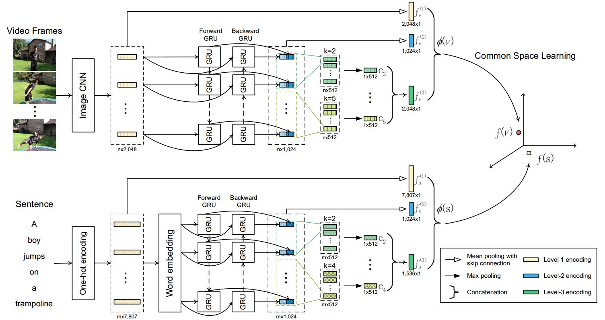

# Dual Encoding for Zero-Example Video Retrieval
Source code of our CVPR'19  paper [Dual Encoding for Zero-Example Video Retrieval](https://arxiv.org/abs/1809.06181).



## Requirements

#### Environments
* **Ubuntu** 16.04
* **CUDA** 10.0
* **python** 2.7
* **torch** 0.3.1

We used virtualenv to setup a deep learning workspace that supports PyTorch.
Run the following script to install the required packages.
```shell
virtualenv --system-site-packages -p python2.7 ~/ws_dual
source ~/ws_dual/bin/activate
cd ~/dual_encoding
pip install -r util/requirements.txt
deactivate
```

#### Required Data
Run `do_get_dataset.sh` or the following script to download and extract MSR-VTT(1.9G) dataset and a pre-trained word2vec(3.0G).
The extracted data is placed in `$HOME/VisualSearch/`.
```shell
ROOTPATH=$HOME/VisualSearch
mkdir -p $ROOTPATH && cd $ROOTPATH

# download and extract dataset
wget http://lixirong.net/data/cvpr2019/msrvtt10k-text-and-resnet-152-img1k.tar.gz
tar zxf msrvtt10k-text-and-resnet-152-img1k.tar.gz

# download and extract pre-trained word2vec
wget http://lixirong.net/data/w2vv-tmm2018/word2vec.tar.gz
tar zxf word2vec.tar.gz
```


## Getting started
Run the following script to train and evaluate `Dual Encoding` network on MSR-VTT.
```shell
source ~/ws_dual/bin/activate
./do_all.sh msrvtt10ktrain msrvtt10kval msrvtt10ktest
deactive
```
Running the script will do the following things:
1. Generate a vocabulary on the training set.
2. Train `Dual Encoding` network and select a checkpoint that performs best on the validation set as the final model. Notice that we only save the best-performing checkpoint on the validation set to save disk space.
3. Evaluate the final model on the test set.


## Expected Performance
Run the following script to evaluate our trained [model]()  on MSR-VTT.
```shell
source ~/ws_dual/bin/activate
MODELDIR=$HOME/VisualSearch/msrvtt10ktrain/cvpr_2019
mkdir -p $MODELDIR
wget -P MODELDIR http://lixirong.net/data/cvpr2019/model_best.pth.tar
CUDA_VISIBLE_DEVICES=0 python tester.py msrvtt10ktest --logger_name $MODELDIR
deactive
```

The expected performance of Dual Encoding on MSR-VTT is as follows. Notice that due to random factors in SGD based training, the numbers differ slightly from those reported in the paper.

|  | R@1 | R@5 | R@10 | Med r |	mAP |
| ------------- | ------------- | ------------- | ------------- |  ------------- | ------------- |
| Text-to-Video | 7.6  | 22.4 | 31.8 | 33 | 0.155 |
| Video-to-Text | 12.8 | 30.3 | 42.4 | 16 | 0.065 |


## How to train Dual Encoding on other datasets?

Store the training, validation and test subset into three folders in the following structure respectively.
```shell
${subset_name}
├── FeatureData
│   └── ${feature_name}
│       ├── feature.bin
│       ├── shape.txt
│       └── id.txt
├── ImageSets
│   └── ${subset_name}.txt
└── TextData
    └── ${subset_name}.caption.txt

```

* `FeatureData`: video frame features. Using [txt2bin.py](simpleknn/txt2bin.py) to convert video frame feature in the required binary format.
* `${subset_name}.txt`: all video IDs in the specific subset, one video ID per line.
* `${dsubset_name}.caption.txt`: caption data. The file structure is as follows, in which the video and sent in the same line are relevant.
```
video_id_1#1 sentence_1
video_id_1#2 sentence_2
...
video_id_n#1 sentence_k
...
```

When the data is ready, use the following script to train and evaluate Dual Encoding on your own dataset.
```shell
source ~/ws_dual/bin/activate
./do_all_own_data.sh ${train_set_name} ${val_set_name} ${test_set_name} --img_feature=${feature_name} --n_caption=${caption_num}
deactive
```
where `train_set_name`, `val_set_name` and `test_set_name` indicate the name of training, validation and test set, respectively. Besides, `feature_name` is the visual feature name and `caption_num` denotes the number of captions for each image. For the MSRVTT dataset, the value of `caption_num` is 20. 


## References
If you find the package useful, please consider citing our CVPR'19 paper:
```
@inproceedings{cvpr2019-dual-dong,
title = {Dual Encoding for Zero-Example Video Retrieval},
author = {Jianfeng Dong and Xirong Li and Chaoxi Xu and Shouling Ji and Yuan He and Gang Yang and Xun Wang},
booktitle = {IEEE Conference on Computer Vision and Pattern Recognition (CVPR)},
year = {2019},
}
```